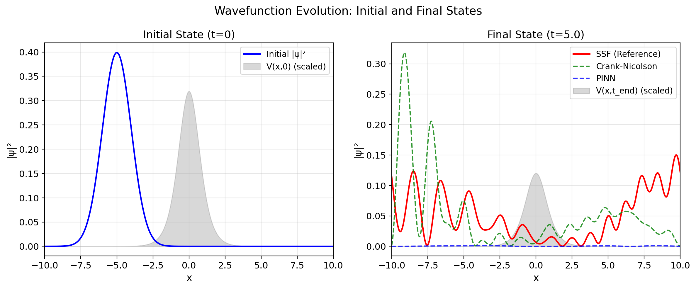
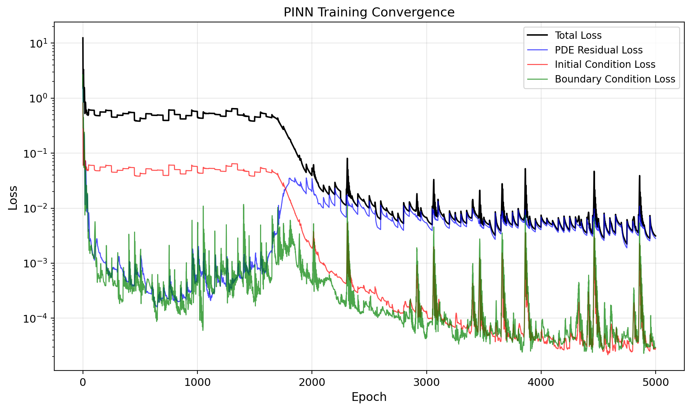
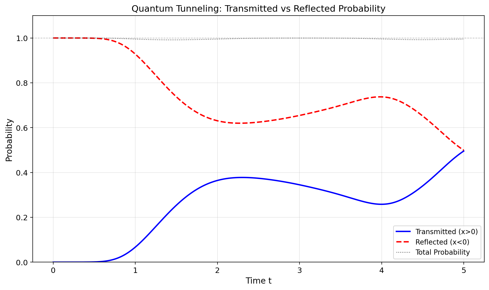

# PINN-Schrodinger: Physics-Informed Neural Network for Quantum Tunneling

[](https://www.python.org/)
[](https://pytorch.org/)
[](LICENSE)

**物理信息神经网络（PINN）求解含时薛定谔方程 —— 量子隧穿效应无网格模拟**

本项目实现了基于物理信息神经网络（Physics-Informed Neural Network, PINN）的含时薛定谔方程求解器，无需空间网格划分即可模拟量子隧穿效应，并将结果与传统数值方法进行系统对比。

## 📖 项目概述

本项目是量子力学课程大作业，探索了深度学习在量子力学数值计算中的应用。主要特色：

- **无网格求解**：PINN通过连续神经网络表示波函数，摆脱了传统有限差分法对空间网格的依赖
- **物理信息嵌入**：将薛定谔方程的偏微分约束直接融入神经网络的损失函数
- **自动微分**：利用PyTorch的`autograd`引擎精确计算波函数对时空变量的高阶导数
- **量子隧穿模拟**：研究含时周期性微扰势场下的量子隧穿效应
- **系统验证**：与Crank-Nicolson有限差分法和Split-Step Fourier方法进行精度对比

## 🧪 物理问题

### 控制方程

一维含时薛定谔方程（无量纲单位，ℏ=1, m=1/2）：

$$i\frac{\partial\psi}{\partial t} = -\frac{\partial^2\psi}{\partial x^2} + V(x,t)\psi$$

### 势函数

$$V(x,t) = V_0 \cdot \text{sech}^2(x) \cdot [1 + \varepsilon \cdot \sin(\omega t)]$$

其中 $V_0 = 5.0$，$\varepsilon = 0.3$，$\omega = 3.0$。

### 初始条件

$$\psi(x,0) = \frac{1}{(2\pi\sigma^2)^{1/4}} \exp\left(-\frac{(x-x_0)^2}{4\sigma^2}\right) \exp(ik_0 x)$$

其中 $\sigma = 1.0$，$x_0 = -5.0$，$k_0 = 2.0$。

## 📊 核心结果

| 指标 | 数值 |
|------|------|
| PINN 网络结构 | [2, 64, 64, 64, 64, 2] |
| 训练周期 | 5000 epochs |
| 最终 PDE 残差 | 2.81×10⁻³ |
| 损失下降倍数 | ~4000× |
| PINN vs SSF 平均 L² 误差 | 0.3594 |
| 量子隧穿概率 | 49.6% |
| 概率守恒性 | 99.5% |

### 波函数演化



### 训练收敛



### 量子隧穿分析



## 🚀 快速开始

### 环境要求

- Python 3.11+
- PyTorch 2.0+
- NumPy, SciPy, Matplotlib

### 安装依赖

```bash
pip install -r requirements.txt
```

### 运行实验

**1. 运行传统数值求解器（对比基准）**

```bash
python traditional_solver.py
```

> 使用 Crank-Nicolson 有限差分法和 Split-Step Fourier 方法求解，作为高精度参考解。约 1-2 秒完成。

**2. 运行 PINN 求解器**

```bash
python pinn_run.py
```

> 训练物理信息神经网络求解薛定谔方程。CPU 上约 1-2 分钟完成训练。

**3. 生成可视化与对比分析**

```bash
python visualization.py
```

**4. 生成完整实验报告**

```bash
python final_report.py
```

> 自动读取所有实验结果，嵌入图表，生成完整的 `.docx` 格式实验报告。

## 📁 项目结构

```
.
├── pinn_run.py                 # PINN核心求解器（网络定义、训练、预测）
├── traditional_solver.py       # 传统数值求解器（Crank-Nicolson & SSF）
├── visualization.py            # 可视化与对比分析模块
├── final_report.py             # 实验报告自动生成脚本
├── requirements.txt            # Python依赖清单
├── README.md                   # 项目说明文档（本文件）
├── 量子力学PINN实验报告.docx    # 完整实验报告
└── results/                    # 实验结果与图表
    ├── fig_loss.png            # PINN训练损失曲线
    ├── fig_initial_final.png   # 波函数初态与终态对比
    ├── fig_heatmaps.png        # 概率密度时空演化热力图
    ├── fig_potential.png       # 势函数可视化
    ├── fig_tunneling.png       # 量子隧穿概率分析
    ├── fig_error.png           # PINN vs SSF 误差分析
    ├── pinn_model.pt           # 训练好的PINN模型权重
    └── *.npz                   # 数值结果数据
```

## 🔬 方法对比

| 特性 | PINN | Crank-Nicolson | Split-Step Fourier |
|------|------|---------------|-------------------|
| 网格依赖 | 无网格 | 空间网格 (512点) | 空间网格 (512点) |
| 计算时间 | ~70s (训练) | ~1s | ~0.2s |
| 精度 | L²误差 ~0.36 | 二阶精度 | 谱精度（最高） |
| 可微分解 | ✅ 天然可微 | ❌ | ❌ |
| 高维扩展 | 理论上可行 | 维度灾难 | 维度灾难 |
| 反问题能力 | ✅ 支持 | 困难 | 困难 |

## 📚 理论基础

### PINN 方法

PINN将偏微分方程的约束作为软正则化项嵌入神经网络的损失函数：

$$L(\theta) = L_{\text{PDE}} + \lambda_{\text{IC}} \cdot L_{\text{IC}} + \lambda_{\text{BC}} \cdot L_{\text{BC}}$$

- **L_PDE**: 在时空域内部随机配点上满足薛定谔方程
- **L_IC**: 在 t=0 处匹配高斯波包初始条件
- **L_BC**: 在空间边界处波函数趋于零

### 自动微分

通过PyTorch的`autograd`引擎，利用链式法则在计算图上递归传播梯度，精确计算：

$$\frac{\partial\psi}{\partial t}, \frac{\partial\psi}{\partial x}, \frac{\partial^2\psi}{\partial x^2}$$

## 🤖 AI 协同声明

本项目在开发过程中使用 Claude Code（Anthropic）作为 AI 协同研究工具，遵循"协同研究员"定位。AI 协助完成代码框架搭建、公式推导验证和报告初稿生成。团队成员独立完成了物理建模、参数选择、结果分析和报告最终审查。详见报告第8章。

## 📝 参考文献

1. Raissi, M., Perdikaris, P., & Karniadakis, G. E. (2019). *Physics-informed neural networks: A deep learning framework for solving forward and inverse problems involving nonlinear partial differential equations.* Journal of Computational Physics, 378, 686-707.
2. Karniadakis, G. E., et al. (2021). *Physics-informed machine learning.* Nature Reviews Physics, 3(6), 422-440.
3. Griffiths, D. J., & Schroeter, D. F. (2018). *Introduction to Quantum Mechanics* (3rd ed.). Cambridge University Press.

## 📄 许可证

本项目采用 [MIT License](LICENSE)。
